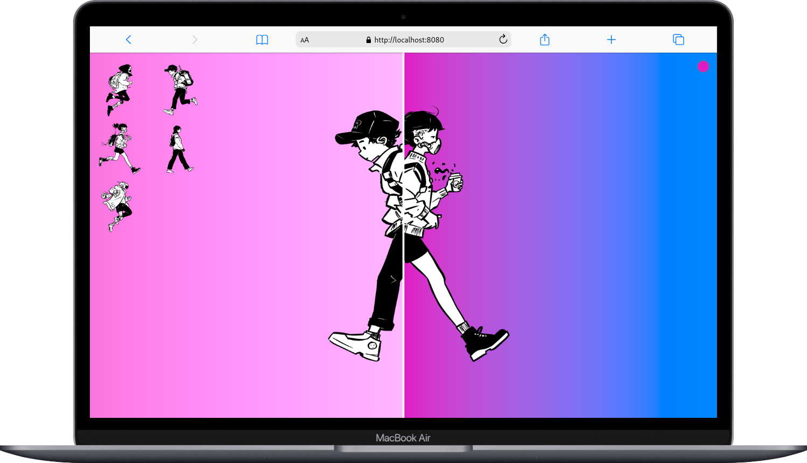

# Compare

# Comparador de Imágenes

## Descripción

Comparador de Imágenes Interactivo. Esta aplicación te permite comparar fácilmente imágenes y personalizar el fondo de pantalla según tus preferencias.

Características Principales:

- Comparación de Imágenes: Explora la función de comparación de imágenes para analizar visualmente las diferencias y similitudes.

- Personalización del Fondo de Pantalla: Cambia el fondo de pantalla de la aplicación según tus intereses y gustos personales.

## Referencias

[GUI Challenges](https://goo.gle/GUIchallenges)
