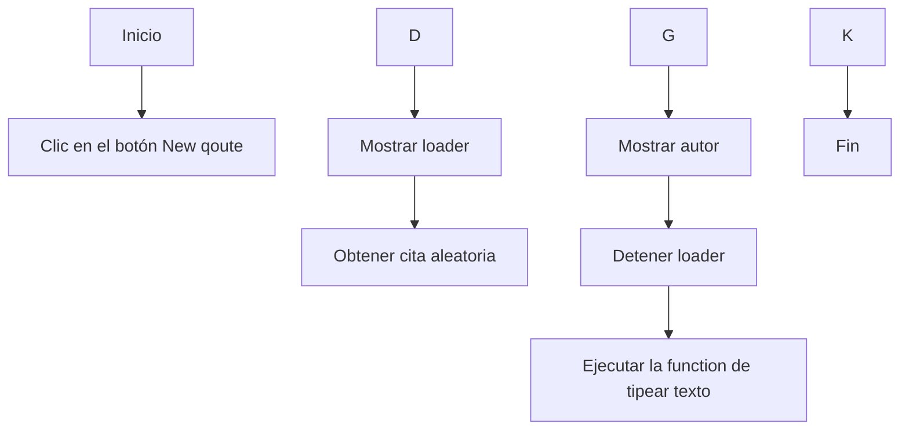

## Type Qoute

```mermaid
graph TD;
  A[Inicio] --> B[Clic en el botón New qoute];
  D --> E[Mostrar loader];
  E --> F[Obtener cita aleatoria];
  H --> I[Detener loader];
  G --> H[Mostrar autor];
  I --> J[Ejecutar la function de tipear texto];
  K --> L[Fin];
```
